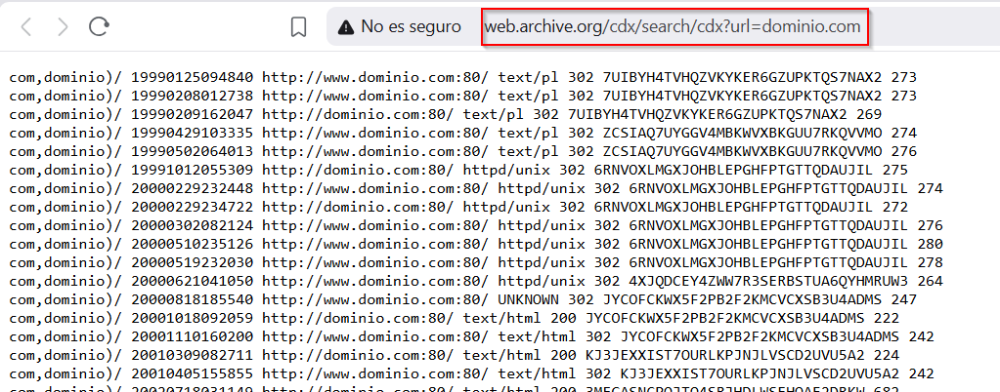
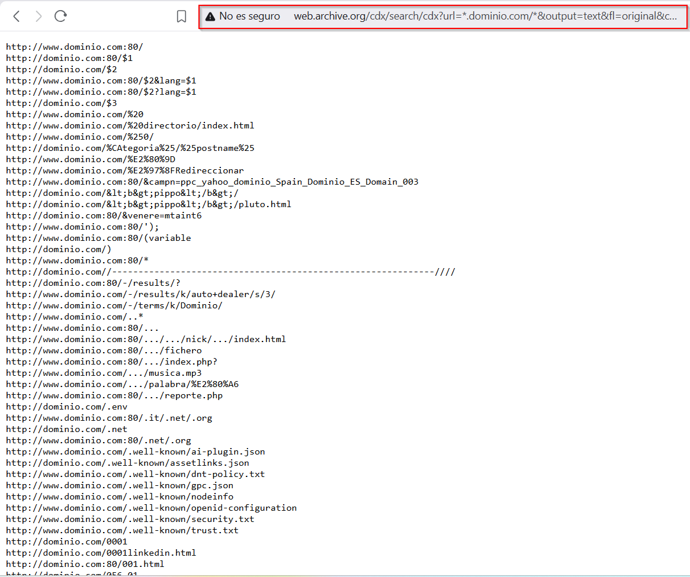
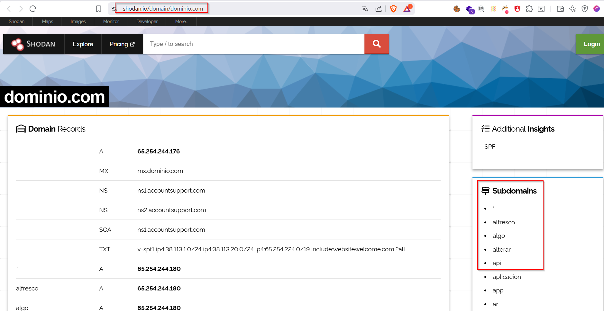
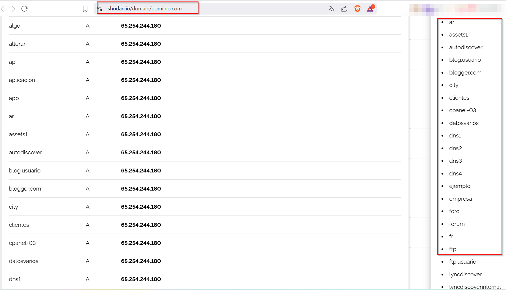
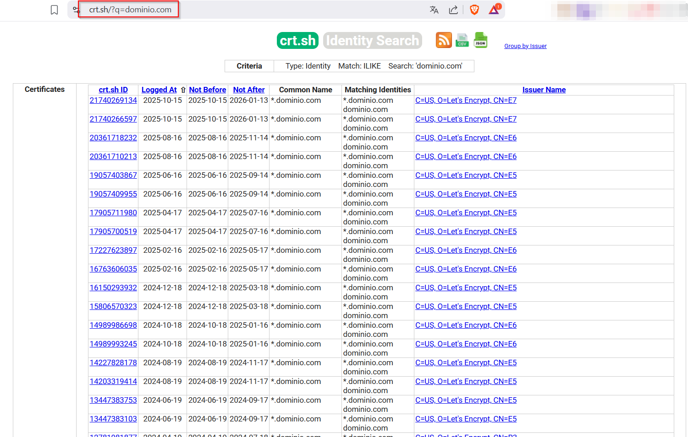
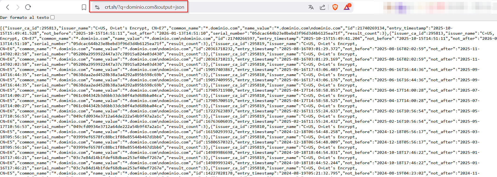
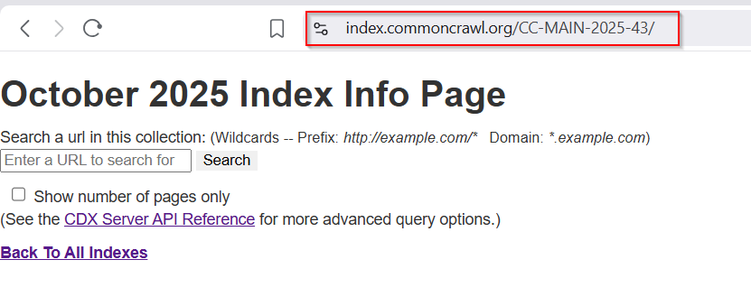
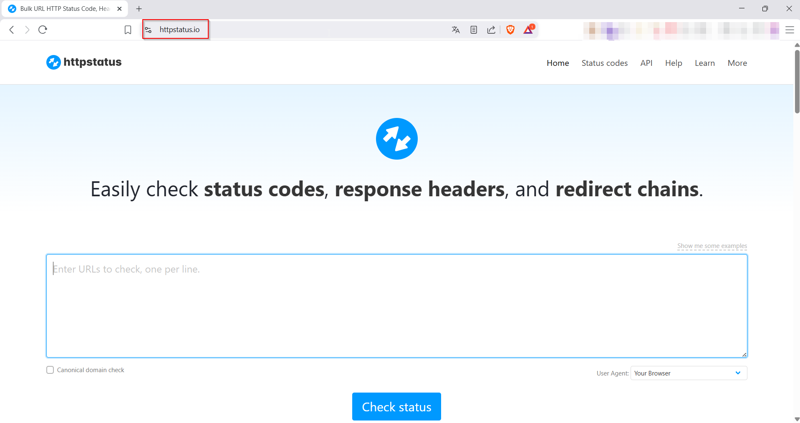
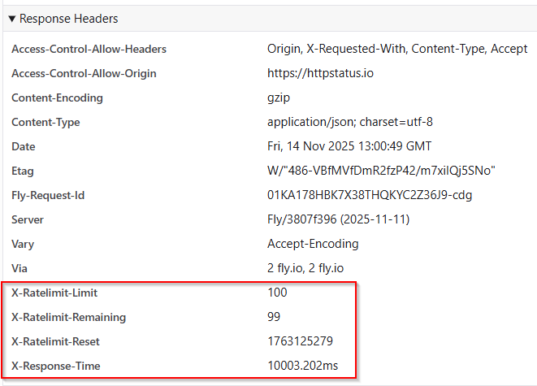

 # Reconocimiento
 
 A continuación se detalla la metodología seguida para reconocer los subdominios asociados a un dominio principal reduciendo en la medida de lo posible las interacciones directas con el objetivo a reconocer. El objetivo es obtener la mayor cantidad de información mediante el reconocimiento pasivo de una manera rápida que permita hacerse una idea del tamaño de la infraestructura que posee el objetivo.
 
No pretende ser una lista exhaustiva de todas las técnicas de reconocimiento existente. Únicamente se detallan los pasos seguidos para hacer el reconocimiento de manera gratuita, sin utilizar ninguna cuenta ni ninguna API-KEY. El último punto incluye un script propio utilizado para automatizar esta tarea, se incluye explicación.

Para la búsqueda de subdominios, se utilizan cuatro fuentes de datos principales:

1. [Web Archive ](https://web.archive.org/)
2. [Shodan Search Engine](https://shodan.io)
3. [Certificate Search](https://crt.sh)
4. [Common Crawl](https://commoncrawl.org/)

Para comprobación del estado de un subdominio encontrado se utiliza [Bulk URL HTTP Status Code, Header & Redirect Checker](https://httpstatus.io)

Para realizar las capturas de pantalla se utiliza [GoWitness](https://github.com/sensepost/gowitness)

Se recomiendan los siguientes recursos de Youtube para profundizar más acerca del tema:

1. [The Bug Hunter's Methodology v4.0](https://www.youtube.com/watch?v=p4JgIu1mceI)
2. [Free Recon Course and Methodology For Bug Bounty Hunters](https://www.youtube.com/watch?v=evyxNUzl-HA)

## 1. Web Archive (http://web.archive.org)

Web Archive (o Wayback Machine) es un proyecto de una organización sin ánimo de lucro que busca preservar el contenido web para que no se pierda con el paso del tiempo.

Ofrece varias [API's RESTful](https://archive.org/help/wayback_api.php) gratuitas que permiten a los desarrolladores acceder programáticamente a los datos archivados. De entre las API's ofrecidas, este documento hablará únicamente de la [CDX Server API](https://github.com/internetarchive/wayback/tree/master/wayback-cdx-server).

`wayback-cdx-server` es un *servlet* HTTP que sirve el mismo índice que el propio `wayback` utiliza para buscar las capturas que tiene almacenadas (una captura = una URL que haya indexado en un momento específico).  El índice almacenado por CDX contiene los siguientes campos para cada captura

- `["urlkey","timestamp","original","mimetype","statuscode","digest","length"]`

El más interesante para el reconocimiento es `original` que es donde se almacena la URL capturada. Pero es interesante entender los distintos campos para filtrar correctamente los resultados.

La API CDX responde a peticiones GET y devuelve la información o en texto plano o en JSON.

La consulta más básica a realizar para obtener todos los campos almacenados en el índice para un dominio concreto es [http://web.archive.org/cdx/search/cdx?url=dominio.com](http://web.archive.org/cdx/search/cdx?url=dominio.com)




### Filtros disponibles

De cara a afinar las consultas realizadas, la API ofrece distintos filtros para hacer las consultas más granulares. 

Para el ejemplo se supone que se ha realizado la consulta http://web.archive.org/cdx/search/cdx?url=dominio.com/contact/

- `matchType`: permite especificar cuándo se considerará que una captura cumple los requisitos y debe ser incluida en la respuesta.
	- `matchType=exact` Es el comportamiento por defecto, solo devolverá resultados que contengan la URL exactamente igual a la pasada como valor del parámetro `url`, en este caso `dominio.com/contact`
	- `matchType=prefix` devolverá todos los resultados que estén **dentro** del path especificado (`dominio.com/contact/`). **También se puede especificar esté `matchType` si se añade un `*` al final de la url (`url=dominio.com/contact/*`)**. 
	- `matchType=host` devolverá todos los resultados pertenecientes al host especificado en el parámetro `url`. En este caso se devolverán también resultados que no se encuentren dentro de `/contact/`.
	- `matchType=domain` devolverá resultados de un dominio y de todos los subdominios. **Este es el más interesante para el caso que nos ocupa. También se puede especificar esté `matchType` si se añade un `*` antes del dominio especificado en la url (`url=*.dominio.com/`)**. 
- `output`
	- `output=json` devolverá formato json.
	- `output=text` devolverá texto. Por defecto devuelve texto.
-  `fl`: permite especificar los campos del índice de cada captura que se devolverán. Permite especificar los campos que se quieran obtener, y reordenarlos también. Las opciones de este parámetro coinciden con los campos del índice.
	- `fl=urlkey`
	- `fl=timestamp`
	- `fl=original`:  este es el campo que nos interesa.
	- `fl=mimetype`
	- `fl=statuscode`
	- `fl=digest`
	-  `fl=length`
- `from`: recibe como valor hasta los 14 dígitos que contiene el timestamp (*yyyyMMddhhmmss*). Filtra resultados cuyo timestamp sea igual o posterior al valor indicado.
- `to`: recibe como valor hasta los 14 dígitos que contiene el timestamp (*yyyyMMddhhmmss*). Filtra resultados cuyo timestamp sea igual o anterior al valor indicado.
- `filter=[!]field:regex`. Permite filtrar los resultados según los distintos campos que componen el índice. En `field` deberá introducirse uno de entre `urlkey,timestamp,original,mimetype,statuscode,digest,length`; en `regex` deberá introducirse algún patrón de Regex standard de Java. Se muestran ejemplos:
	- `filter=!statuscode:200` : Mostrará capturas cuyo statuscode sea diferente a a 200.
	- `filter=digest:2WAXX5NUWNNCS2BDKCO5OVDQBJVNKIVV`: mostrará capturas cuyo digest sea igual al indicado.
- `collapse=field:N`: es una manera distinta de filtrar resultados. Permite eliminar capturas que se encuentren en líneas adyacentes dentro del índice CDX y que sean iguales atendiendo a alguno de los campos (puede especificarse cuantos caracteres han de ser iguales en el campo para que las capturas se muestren o se colapsen). Se muestran ejemplos:
	- `collapse=timestamp:10`. Del listado completo de capturas que se incluyan en el bloque de resultados (ordenado por `urlkey + timestamp`), se mostrarán para aquellas capturas con misma `urlkey` únicamente las que tengan un `timestamp` que difiera entre ellas más de los 10 primeros dígitos, lo cual es similar a decir que solo mostrará una captura por hora de cada `urlkey`.
	- `collapse=urlkey`. Del listado completo de capturas que se incluyan en el bloque de resultados (ordenado por `urlkey + timestamp`),  solo mostrará capturas con `urlkey` distinto. Se mostrarán URL's únicas capturadas por Web Archive del host/dominio especificado. 
- `limit=[-]N`: permite obtener los N primeros resultados o los últimos si se especifica el `-N`.
	- `offset=M`. En conjunción con `limit` se permite especificar un `offset=M` para saltarse los M primeros resultados tras aplicarse el limit.

Hay más filtros disponibles que se pueden comprobar aquí https://github.com/internetarchive/wayback/tree/master/wayback-cdx-server#advanced-usage-1

### Consulta usada

De cara al reconocimiento inicial de un objetivo, no solo son interesantes los subdominios existentes de un dominio principal, sino que las URL's almacenadas de cada subdominio también arrojan mucha información valiosa. Por lo tanto, para obtener la información, la consulta elegida es

 `curl "http://web.archive.org/cdx/search/cdx?url=*.dominio.com/*&output=text&fl=original&collapse=urlkey"`
 


La información mostrada en la respuesta, se procesa para hacer dos cosas con ella:

1. Extraer el listado de subdominios indexados desde el inicio de los tiempos para este dominio principal.
2. Organizar las URLs y dividirlas por subdominios para posterior revisión.
3. Analizar las URLs para buscar las que incluyan ficheros con extensión interesante.

## 2. Shodan (https://shodan.io)

Shodan es un motor de búsqueda que indexa dispositivos, servidores y servicios expuestos en Internet, no páginas web.

- Escanea puertos abiertos, banners de servicios, certificados SSL, metadatos
- Indexa billones de dispositivos (cámaras, routers, servidores, IoT, SCADA, etc.)

Escanea todo el rango de IPv4, y una parte del IPv6. Y para cada host realiza una conexión a los puertos más comunes. 

A grandes rasgos sigue los siguientes pasos:

1. Comprueba IP's públicas activas.
2. Se conecta a puertos conocidos de las mismas
3. Lee banners de los servicios (HTTP, FTP, SSH...etc)
4. Extrae metadatos. Por ejemplo:
	1. Cabecera Server en respuesta HTTP: `Server: nginx`
	2. Certificado SSL: `CN: admin.example.com`
5. Asocia la IP con la información recolectada.

De entre las muchas posibilidades que tiene, para obtener subdominios interesa la consulta "https://shodan.io/domain/dominio.com". 




Pese a que Shodan dispone de API's, se realiza la consulta de esta manera para evitar la necesidad de iniciar sesión en ninguna plataforma ni de proporcionar *API_KEY*. 

La información contenida en el HTML se procesa para extraer los subdominios.


## 3. Certificate Search (https://crt.sh)

Es un buscador público de certificados SSL/TLS emitidos por las distintas autoridades de certificación (CA's). Lo que hace es indexar la información contenida en los logs de transparencia de certificados (Certificate Transparency Logs) de las distintas autoridades de certificación. 
Los CT logs son un documento que desde 2015 las CA's tienen que publicar y actualizar (por ley) dónde se recogen todos los certificados que ha emitido la CA.

Certificate Search descarga los CTLogs y decodifica los certificados extrayendo:

1. CN o Common Name
2. Subject Alternative Name (SAN)

Por cómo funciona, entre los subdominios mostrados por Certificate Search es posible encontrar subdominios que nunca han estado expuestos a internet (P.E. un subdominio interno de una organización que necesite SSL/TLS. No será accesible desde internet pero estará incluido en el CT Log de la CA que haya expedido el certificado SSL/TLS)

La consulta que se realiza para obtener todos los certificados  asociados a un dominio principal  y que estén indexados por crt.sh es "https://crt.sh/?q=dominio.com"



Otra opción que ofrece es formatear la respuesta en JSON, para ello hay que añadir e parámetro `output=json`.



La información obtenida se procesa para extraer un listado de subdominios. 

## 4. Common Crawl  (https://commoncrawl.org/)

Contiene una copia pública de internet que se realiza mensualmente desde 2008.

La información se almacena en crawls mensuales cuyo nombre tiene la siguiente forma:

- CC-MAIN-2025-43 - Octubre 25
- CC-MAIN-2025-38 - Septiembre 25
- CC-MAIN-2025-33 - Agosto 25
- ...etc

De cara a realizar consultas relativas a dominios, hay que especificar en que crawl se quiere buscar.



Tal y como se indica en la imagen, permite especificar *wildcards* tanto para el dominio como para el prefijo. Para acceder a las respuestas y obtener subdominios se introduce la url a buscar en el parámetro `url`, en caso de querer el output en formato json se puede especificar en el parámetro `output=json`

La consulta realizada es https://index.commoncrawl.org/CC-MAIN-2025-43-index?url=*.dominio.com/*&output=json"


Igual que en el caso de Wayback Machine, la información obtenida en Common Crawl se utiliza para:

1. Extraer el listado de subdominios indexados desde el inicio de los tiempos para este dominio principal.
2. Organizar las URLs y dividirlas por subdominios para posterior revisión.
3. Analizar las URLs para buscar las que incluyan ficheros con extensión interesante.


## 5. HTTP/s Bulk Status Checker (https://httpstatus.io)

Una vez se han obtenido los subdominios desde las distintas fuentes indicadas, de cara a eliminar subdominios antiguos/inaccesibles/muertos para futuras pruebas se comprueba el estado de los mismos. 

Dado que no interesa comunicar directamente con la infraestructura del objetivo, se utiliza un intermediario que realice la comprobación por nosotros.

Antes de continuar, hay que indicar que con este procedimiento no se está comprobando que subdominios están realmente vivos, se está comprobando qué subdominios tienen un servidor web corriendo, ya sea HTTP (80) o HTTPS (443). Existen otras herramientas que pueden hacer un escaneo de puertos rápido si reciben un listado grande de subdominios pero no se hará uso de las mismas aquí.

 

La herramienta tiene las siguientes restricciones:

- Las URL's a comprobar se deben de agrupar en lotes de 100 URL's como máximo. 
- No se puede comprobar simultáneamente el estado en el 80 y en el 443.
- Existe un límite de 100 peticiones por minuto (máximo de URLs comprobadas en 1 minuto sería 10000)

Al pulsar en "Check Status" se genera una petición POST a https://backend-v2.httpstatus.io/api con el siguiente payload:

```json
{
	"urls":["http://dominio.com"],
	"userAgent":"browser",
	"userName":"",
	"passWord":"",
	"headerName":"",
	"headerValue":"",
	"strictSSL":true,
	"canonicalDomain":false,
	"additionalSubdomains":["www"],
	"followRedirect":true,
	"throttleRequests":100,
	"escapeCharacters":false
}
```
 
 La respuesta contiene el siguiente JSON
 
```json
[
  {
    "requestedURL": "http://dominio.com",
    "numberOfRedirects": "1",
    "redirects": [
      {
        "statusCode": 301,
        "redirectUri": "http://www.domain.com"
      }
    ],
    "redirectChain": "301",
    "fullRedirectChain": [
      {
        "statusCode": 301,
        "url": "http://dominio.com",
        "parsedUrl": {
          "slashes": true,
          "protocol": "http:",
          "hash": "",
          "query": {},
          "pathname": "",
          "auth": "",
          "host": "dominio.com",
          "port": "",
          "hostname": "dominio.com",
          "password": "",
          "username": "",
          "origin": "http://dominio.com",
          "href": "http://dominio.com"
        }
      },
      {
        "statusCode": 403,
        "url": "http://www.domain.com",
        "parsedUrl": {
          "slashes": true,
          "protocol": "http:",
          "hash": "",
          "query": {},
          "pathname": "",
          "auth": "",
          "host": "www.domain.com",
          "port": "",
          "hostname": "www.domain.com",
          "password": "",
          "username": "",
          "origin": "http://www.domain.com",
          "href": "http://www.domain.com"
        }
      }
    ],
    "redirectURLChain": [
      "http://dominio.com",
      "http://www.domain.com"
    ],
    "statusCode": 403,
    "statusMessage": "Forbidden",
    "requestId": "228fce7a-41af-48b5-bd8e-4076ddb8bedc"
  }
]
```

Analizando las cabeceras HTTP de la respuesta se puede comprobar que la API está limitada a una tasa de 100 peticiones por minuto



La idea es comprobar con este método todos los subdominios obtenidos para ver cuáles de ellos están activos en HTTP y cuáles en HTTPS generando un fichero con los subdominios activos en HTTP y otro con los activos en HTTPS.

*Nota: en el script inicialmente se generaba otro fichero con las redirecciones realizadas por cada subdominio. Tras trabajar con el script durante un tiempo se decidió eliminar la generación de ese documento del código porque no se utilizaba y la estructura de ficheros interesa reducirla para limitar el espacio ocupado en caso de dominios grandes.*

## 6. Capturas de Pantalla con GoWitness (https://github.com/sensepost/gowitness)

**En este paso se contacta directamente con la infraestructura del objetivo.**

Si el reconocimiento debe ser pasivo y se quiere evitar esta fase, comentar las líneas 916 y 917 del script.

Una vez se han obtenido aquellos subdominios de un dominio principal que tienen un servidor web corriendo en el 80 o en el 443, de cara a poder evaluar de un vistazo cuáles de esos objetivos son más interesantes para continuar investigando se utiliza la herramienta [GoWitness](https://github.com/sensepost/gowitness) que mediante el uso del navegador *headless* de Chrome accede a la web y realiza una captura de pantalla.

GoWitness permite diversas operaciones. De entre los comandos principales el que interesa en este punto es `gowitness scan file` que recibe un fichero conteniendo un listado de hosts, intenta realizar capturas en los puertos 80 y 443 por defecto (se puede elegir en qué puertos se quiere realizar), y almacena la información en un csv llamado gowitness.csv .

```bash
gowitness scan file -f input_file --write-csv
```

## 7. Automatización Reconocimiento.

De cara a realizar el reconocimiento de manera automatizada se escribe un script llamado [metrallaFinder](https://saco.ciber.def/india/codigo/information-gathering/infra-recon/-/tree/script-upload) en python.


